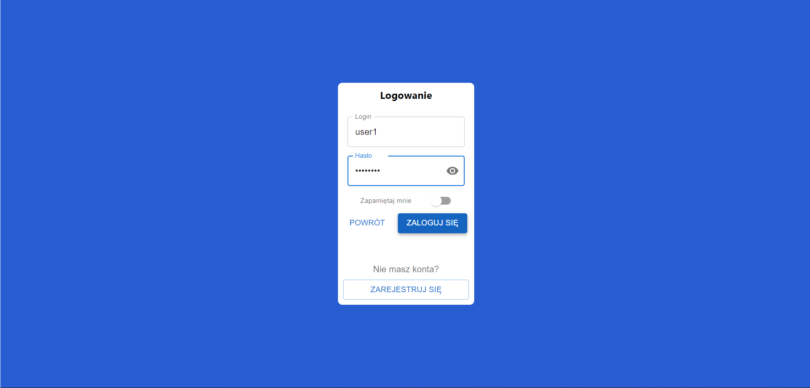

## Web Protocols Project

Website project with users, chats, auctions, comments. Website created with React, JavaScript, CSS, SCSS, Express, MongoDB, MQTT, HiveMQ. The project was made for a Web Protocols course at the University of Gdańsk.

## Project Status

Project completed on 1 February 2022

## Project Screen Shot(s)





## Technologies Used

-   axios
-   buffer
-   cors
-   crypto-js
-   dotenv
-   express
-   formik
-   fs
-   js-cookie
-   lodash
-   material-ui-confirm
-   mongoose
-   mqtt
-   mui
-   prettier
-   react
-   react-dom
-   react-router-dom
-   react-scripts
-   url
-   web-vitals
-   yup

## Installation and Setup Instructions

Before starting the project, you must start the MongoDB database. You can run it using Docker. You need to install Docker, then use the command to start the MongoDB container.

`docker run -dp 27017:27017 --name mongodb mongo`

In addition, you need the HiveMQ broker. You can download and install it from this page https://www.hivemq.com/downloads/ or run the container in Docker with the command

`docker run -p 8080:8080 -p 1883:1883 hivemq/hivemq4`

In the config.xml file, you must add this entry to enable the MQTT over WebSockets feature (more details here https://www.hivemq.com/blog/mqtt-over-websockets-with-hivemq/).

```
<?xml version="1.0"?>
<hivemq xmlns:xsi="http://www.w3.org/2001/XMLSchema-instance"
        xsi:noNamespaceSchemaLocation="../../hivemq-config.xsd">

   <listeners>
      <websocket-listener>
          <port>1884</port>
          <bind-address>0.0.0.0</bind-address>
          <path>/mqtt</path>
          <subprotocols>
              <subprotocol>mqttv3.1</subprotocol>
              <subprotocol>mqtt</subprotocol>
          </subprotocols>
          <allow-extensions>true</allow-extensions>
      </websocket-listener>
       ...
   </listeners>
    ...
</hivemq>
```

Clone down this repository. You will need `node` and `npm`/`yarn` installed globally on your machine.

Installation:

`npm install` or `yarn install`

To Start Server and App:

`npm start` or `yarn start`

To Visit App:

`localhost:3000/`

## Functionalities

A more detailed description of the functionalities is in the file functionalities.md

-   It is possible to add auctions, auction comments, user comments.
-   You can search auctions.
-   You can register, login, change your password, delete your account.
-   There is a limit on failed login attempts and a limit on the number of possible registrations per hour.
-   You can create and delete public chat rooms and private chats.
-   You can give likes and dislikes to comments and to users.
-   On the auction page there is a counter of views auctions and a counter of users who currently watch the auctions.
-   There are special notifications when:
    -   someone will buy your auction
    -   when someone buys the product you are looking at
    -   when someone creates a private chat with you
    -   when someone sends you a private message
-   All events are saved in logs.
-   Use of TLS certificates.
-   Passwords in the database are encrypted
-   Different user roles:
    -   Non-logged-in users - only viewing the auctions
    -   Logged in users
    -   Administrators - additionally can add, edit all users, auctions, comments, chat rooms
